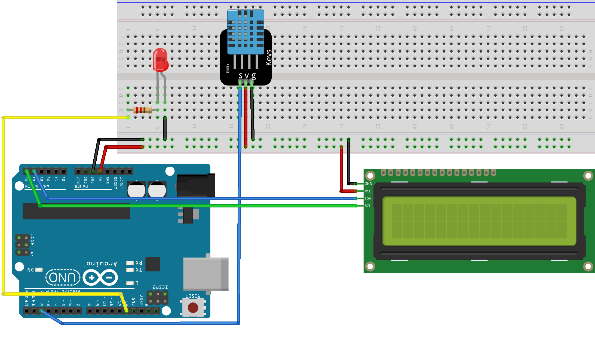

# Rust Arduino project

Connects with API following a protocol.
Serves DHT measurements and listens to actions for LED and message display.

## Setup

### Arduino connections

- Display
    - SDA: pin A4
    - SCL: pin A5
- LED: pin 13
- DHT11: pin 2



### Build & deploy on Arduino
If you don't have them already, install `ravedude`:

```bash
cargo install cargo-generate
cargo install ravedude
```

Then to run:
`cargo run`
